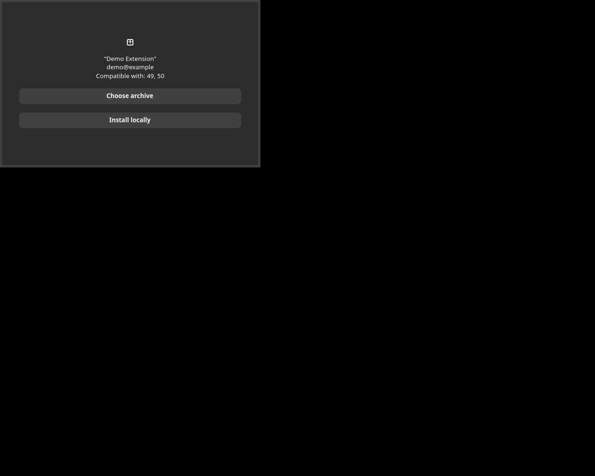

# Screenshots

App screenshots show the current local build in English. The Calendar image is a source-derived GTK preview because the full local Calendar build is blocked by unrelated Blueprint compatibility errors; the limitation is recorded in `VALIDATION.md`.

| Artifact | Image | What it demonstrates |
| --- | --- | --- |
| Focus Block | [focus-block.png](screenshots/focus-block.png) | Focus and break durations, countdown, start, and reset controls. |
| Clip Shelf | [clip-shelf.png](screenshots/clip-shelf.png) | The manual local clipboard shelf UI. |
| GNOME Calendar default reminder patch | [calendar-default-reminder.png](screenshots/calendar-default-reminder.png) | The source-derived Preferences UI showing a calendar-specific default reminder. |
| Command Shelf | [command-shelf.png](screenshots/command-shelf.png) | Named local snippets and explicit clipboard copying. |
| Name Shift | [name-shift.png](screenshots/name-shift.png) | A valid local rename preview before the explicit rename action is applied. |

For patches without a visible interface, `VALIDATION.md` records the testable behavior and commands instead of inventing a visual result.

## Extension Pack Installer

Actual GTK application window captured under Xvfb after a demo archive passed path and metadata validation. It shows the extension name, UUID, declared Shell versions, and the enabled explicit install action.
